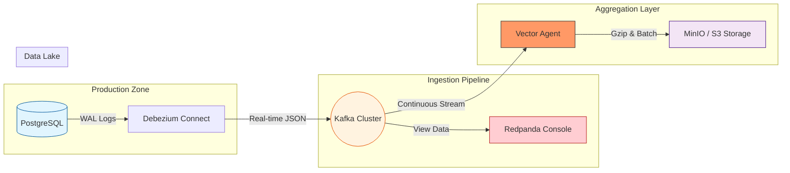
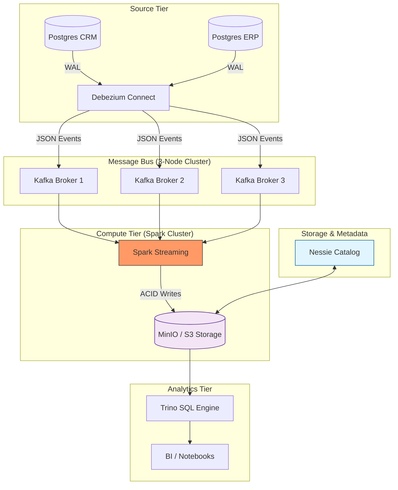

# Modern CDC Sandbox

An end-to-end, enterprise-grade Change Data Capture (CDC) playground.

This project simulates a high-performance data pipeline transferring real-time database changes into a Data Lake (Object Storage), optimized for high throughput and disaster recovery.

## Architecture

PostgreSQL -> Debezium -> Kafka -> Vector -> MinIO (S3)



- PostgreSQL: Source database with logical replication enabled.
- Debezium: Captures row-level changes (INSERT/UPDATE/DELETE) as events.
- Kafka: Acts as a resilient buffer (Persistence layer).
- Vector: Aggregates fine-grained events into compressed micro-batches.
- MinIO: High-performance S3-compatible object storage for data archiving.
- **Redpanda Console**: Web-based UI to visualize real-time message flow in Kafka.

## Key Features

- **Zero-Dependency Stress Tests**: No Python or external runtimes required (Docker-based).
- **Peak Performance**: Verified throughput of 130,000+ TPS on a standard developer machine.
- **Observability Stack**: Built-in real-time throughput dashboards and message inspectors.
- **Disaster Recovery**: Built-in Circuit Breaker mechanism using `max_slot_wal_keep_size` to protect the primary DB during downstream outages.
- **Micro-batching**: Automatically groups 1000s of small JSON events into a single compressed .gz file to minimize storage costs and API calls.

## Quick Start

### Prerequisites

Before you begin, ensure you have the following installed:
- Docker & Docker Compose (Latest version)
- Make (To run Makefile commands)
- Curl (To register connectors via API)
- Minimum 4GB RAM allocated to Docker

### 1. Launch Infrastructure
```bash
make up
```

### 2. Setup CDC Pipeline
```bash
make setup
```

### 3. Run Stress Tests (Choose a Mode)

The sandbox provides three modes to simulate different business scenarios:

#### Mode 1: Bulk Injection
Inserts 100,000 rows in a single transaction. Useful for observing how CDC handles large spikes.
```bash
make stress-bulk
```

#### Mode 2: Continuous Trickle
Simulates real-time user traffic (5-10 orders per second) using a shell-based loop. **No Python required.**
```bash
make stress-trickle
```

#### Mode 3: Fury Mode
Extreme high-speed loop using internal DB procedures. Use this to test the physical limits of your hardware.
```bash
make stress-fury
```

### 4. Observability & Monitoring

The sandbox includes built-in tools to watch the data flow:

1.  **Kafka Console**: Open http://localhost:8080 to see real-time JSON messages passing through topics.
2.  **Throughput Dashboard**: Run `make vector-top` to see real-time ingestion/sink metrics (Events In/Out).
3.  **MinIO Web UI**: Open http://localhost:9001 (minio_admin / minio_password) to verify data partitioning in S3.

## Cleanup

To stop the environment, choose one of the following methods:

### Option 1: Full Teardown (Recommended)
Stops all containers and **deletes all data** (volumes). Use this to restore a clean state.
```bash
make down
```

### Option 2: Temporary Stop
Stops the containers but **preserves your data**. Use this if you want to resume later.
```bash
docker-compose stop
```
*To resume, run `docker-compose start`.*

## Advanced Scenarios

This sandbox is designed for learning and testing:
- **Consumer Lag Recovery**: Stop Kafka and see how Postgres handles WAL accumulation.
- **Self-Healing**: Reboot the database and watch the pipeline automatically re-establish connectivity.
- **Schema Evolution**: Add columns to Postgres and observe how Debezium adapts.

## Production Mode (Lakehouse / Iceberg)

This mode simulates a robust **real-time Lakehouse** architecture. It transitions from simple event aggregation to a formal data lake using **Apache Iceberg** for table management, **Project Nessie** for catalog versioning, and **Spark Streaming** for transactional ingestion.

### Production Architecture



### Standard Execution Order

To ensure a successful deployment, follow this exact sequence:

1.  **Launch Cluster**: Build and start all 16 containers with optimized resources.
    ```bash
    make prod-up
    ```
2.  **Register Connectors**: Activate CDC pipelines for all source databases.
    ```bash
    make prod-setup
    ```
3.  **Initialize Data (Crucial)**: Inject initial records to trigger Kafka topic creation.
    ```bash
    # Debezium only creates topics when it detects data.
    # Spark will fail if topics do not exist.
    make stress-bulk
    ```
4.  **Start Ingestion**: Submit the Spark job to process the stream into Iceberg.
    ```bash
    # This runs in the foreground so you can observe the 'numOutputRows: 100000' log.
    make spark-submit
    ```
5.  **Query & Verify**: Use Trino to perform OLAP queries on the data lake.
    ```bash
    docker exec mini-data-lake-cdc-trino-1 trino --execute "SELECT count(*) FROM iceberg.db.orders"
    ```

### Core Precautions & Optimizations

-   **Automatic Cleanup**: We use **Docker Named Volumes** (`minio_data`). Running `make prod-down` will completely wipe the data lake and checkpoints, ensuring your next test starts from a truly clean slate.
-   **Resource Allocation**: The production Spark Worker is configured with **4GB RAM** and **12 Cores** to prevent scheduling hangs during high-throughput ingestion.
-   **Jar Consistency**: The system is tuned to use a shared Ivy cache (`/tmp/spark-ivy-cache`). This ensures the Spark Driver and Executors use identical Iceberg library versions, preventing `InvalidClassException`.
-   **S3 Connectivity**: AWS Region and Credentials are pre-injected into the Spark environment variables, ensuring stable connectivity between Spark and MinIO without complex code overrides.
-   **Schema Resilience**: The ingestion script handles Debezium's simplified JSON format (`schemas.enable=false`) and automatically maps `updated_at` to the Iceberg `created_at` partition column.

### Troubleshooting

| Issue | Root Cause | Solution |
| :--- | :--- | :--- |
| `UnknownTopicOrPartition` | Topics not created yet | Run `make stress-bulk` before starting Spark |
| `InvalidClassException` | Jar version mismatch | Run `make prod-down` and clear `storage/spark-cache` |
| `Initial job not accepted` | Worker resource starvation | Wait 15s or `docker restart spark-master spark-worker` |
| No data in Trino | Offset mismatch in Checkpoint | Run `make prod-reset-checkpoint` |

---

## License
MIT
